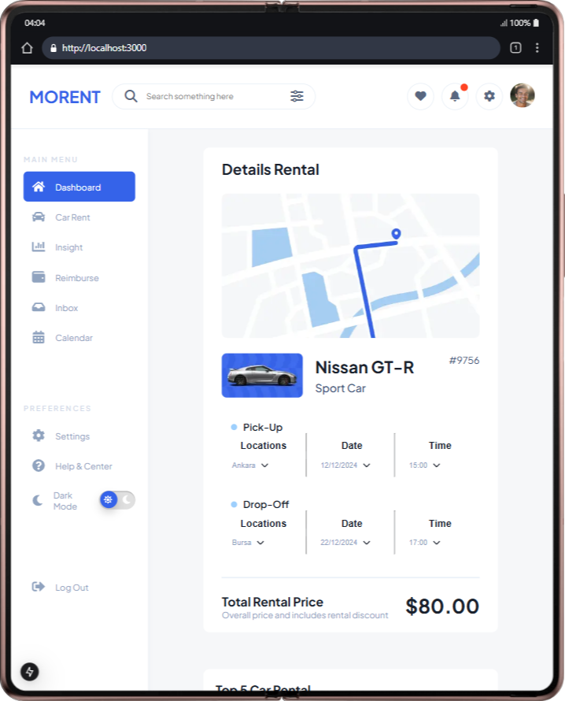
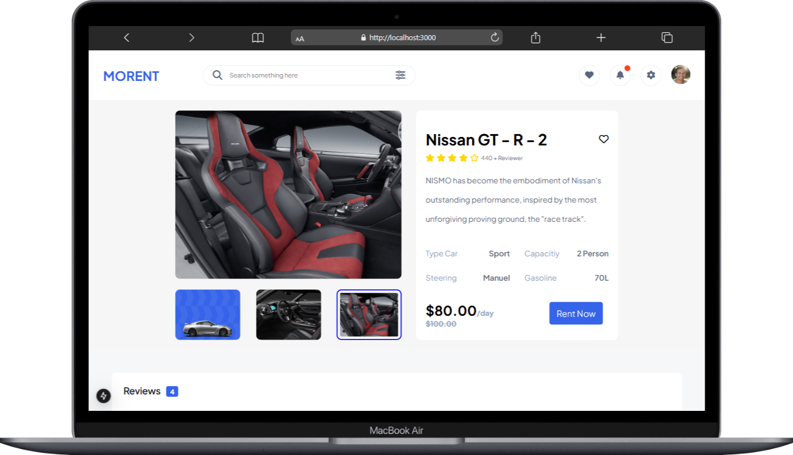

# Morent Car Rental Project

Morent is a modern and user-friendly web application that allows users to easily browse and rent various cars. The project is built with **Next.js** and **React**, providing a fast, secure, and SEO-friendly platform for car rental services. All pages are fully responsive, ensuring seamless experience on mobile, tablet, and desktop devices.

## Features

- Car list and detail pages
- Price, discount, review, and rating information
- Recent and recommended cars section
- Billing and payment info form
- Advanced filtering and search options
- **Admin dashboard** for management (add/edit/delete cars, manage users and reservations, view statistics)
- Responsive design for mobile, tablet, and desktop

## Technologies Used

- **Next.js:** Server-side rendering (SSR) and static site generation (SSG) for fast and SEO-friendly pages
- **React:** Component-based architecture for dynamic and reusable interfaces
- **Styled Components:** Modern and flexible styling
- **API Integration:** Next.js API routes for car and user data
- **Responsive Design:** Media queries and flexible grid system

## Setup

1. Clone the repository:
   ```sh
   git clone https://github.com/busramestan/Morent-Car.git
   ```
2. Install dependencies:
   ```sh
   npm install
   ```
3. Start the project:
   ```sh
   npm run dev
   ```

## Screenshots

### Mobile View


### Tablet View


### Desktop View


---